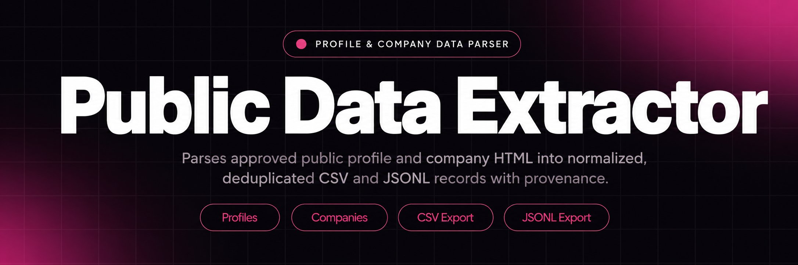
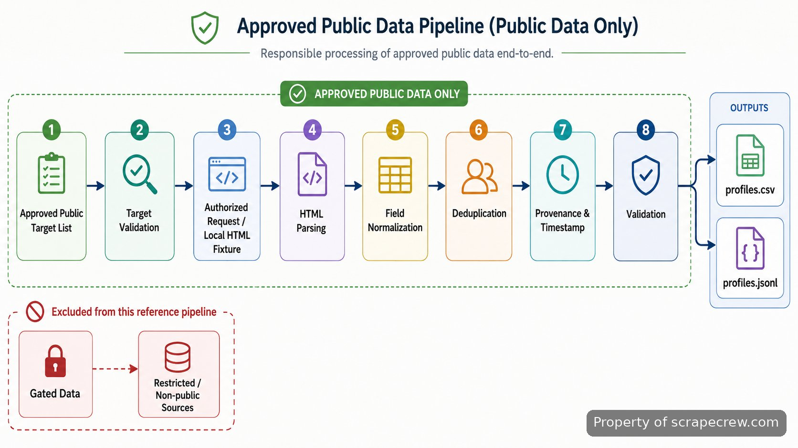

<p align="center">
  <a href="https://www.scrapecrew.com" target="_blank" rel="nofollow">
    
  </a>
</p>

## LinkedIn Scraper

LinkedIn Scraper is a reference implementation for turning publicly visible company and profile pages into structured records. It shows the pieces I need to reason about in a real extraction pipeline: target configuration, HTTP request handling, HTML parsing, conservative pacing, proxy-aware transport, normalization, deduplication, provenance, validation, and export. The repository is intentionally not a clone-and-run production collector. Live access rules, permission, identity, legal basis, retention, and operating limits have to be resolved before any production use.

> The repository demonstrates the data path from an approved public target to a traceable CSV or JSONL record; it does not provide a bypass for access controls.

That distinction matters on this platform. The current <a href="https://ac.linkedin.com/legal/user-agreement" target="_blank" rel="nofollow">User Agreement</a> prohibits software or processes that scrape or copy the service, including profiles and other data, unless separately permitted. The platform's <a href="https://www.linkedin.com/help/linkedin/answer/a1341387" target="_blank" rel="nofollow">prohibited software guidance</a> repeats the restriction. Treat the code here as architectural reference and educational material, not as permission to run automated collection against live pages.

<a href="https://www.scrapecrew.com" target="_blank" rel="nofollow">
  
</a>

<p align="center">
  <a href="https://t.me/Bitbash333" target="_blank" rel="nofollow">
    
  </a>&nbsp;
  <a href="https://wa.me/923249868488?text=Hi%2C%20I%27m%20interested." target="_blank" rel="nofollow">
    
  </a>&nbsp;
  <a href="mailto:hello@scrapecrew.com" target="_blank" rel="nofollow">
    
  </a>&nbsp;
  <a href="https://www.scrapecrew.com" target="_blank" rel="nofollow">
    
  </a>
</p>

## What the Reference Demonstrates

The useful part of this repository is the separation of concerns. Targets are defined independently from fetching. Fetch results are handed to parsers rather than mixed with network code. Parsed fields are normalized before deduplication, and every accepted record keeps source and collection metadata so later review can answer where a value came from. That shape makes failures visible: a network response can fail without corrupting parsing logic, and a parser change can be tested against saved fixtures without making another request.

The collection layer is deliberately narrow. It accepts a configured target, applies headers and timeouts, respects a pacing policy, and can route traffic through an explicitly configured proxy endpoint when that routing is authorized. It does not include account automation, cookie theft, CAPTCHA solving, fingerprint spoofing, or routines for defeating rate limits. Response handling distinguishes success from temporary failures such as HTTP 429 or selected 5xx responses, while permanent failures are written to the run log instead of retried forever.

## Core Features

| Feature | Description |
| --- | --- |
| Configurable targets | Hard-coded URLs make reference code difficult to test or reuse. Targets live in input configuration so company and profile fixtures can pass through the same pipeline without changing parser code. |
| Structured record output | Copy-and-paste research loses field boundaries and source context. The parser maps selected public fields into stable records that can be written as CSV or JSONL. |
| Proxy-aware transport | Network routing sometimes has to pass through an approved gateway or controlled environment. The transport layer accepts proxy configuration without shipping rotation or evasion logic. |
| Rate and retry controls | Unbounded retries can multiply load and hide failures. Request handling exposes pacing, timeout, and bounded retry settings and records the final status when a request cannot continue. |
| Normalization and deduplication | The same organization or person can appear through more than one target. Canonical field cleanup and stable record keys keep duplicate rows from silently expanding an export. |
| Provenance fields | A clean value without its origin is hard to audit. Each output record can retain the source URL, target type, collection timestamp, and parser status used to create it. |

## Technical Stack

The stack stays intentionally small. <a href="https://docs.python.org/3/" target="_blank" rel="nofollow">Python</a> holds the CLI, configuration, parsing, normalization, and export code in one readable runtime. <a href="https://requests.readthedocs.io/en/stable/" target="_blank" rel="nofollow">Requests</a> handles illustrative HTTP transport with explicit timeouts and response status checks. <a href="https://www.crummy.com/software/BeautifulSoup/bs4/doc/" target="_blank" rel="nofollow">Beautiful Soup</a> handles HTML parsing so selectors operate on a parse tree instead of brittle string slicing. These components are enough to explain the reference path without pretending this repository contains every production dependency.

The parser interface is fixture-first. Saved HTML under `tests/fixtures/` makes selector tests repeatable and avoids turning every test into network activity. The export layer writes two ordinary outputs, UTF-8 CSV and line-delimited JSON, so records remain easy to inspect with a text editor, spreadsheet, Python, or a downstream data job.

## Data Flow and Output Contract

A run starts with an approved target list. The loader validates target type and source location, then the transport layer either reads a local fixture or performs an explicitly enabled fetch. The parser extracts only configured fields. Normalization trims whitespace, standardizes empty values, and prepares stable keys. Deduplication compares those keys before the exporter writes accepted rows. The run log keeps rejected targets and parse failures separate from valid data so a partial run cannot masquerade as complete.



The output contract is intentionally traceable rather than broad. A profile-shaped record can contain a display name, headline or role text, location text, source URL, target type, collection timestamp, and parser status when those fields are present in the approved source. A company-shaped record can carry name, description text, location, source URL, target type, timestamp, and parser status. Missing values remain empty rather than being guessed or enriched from unrelated sources.

<a href="https://tally.so/r/BzWjZQ?platform=GitHub&amp;format=Product+repo&amp;brand=ScrapeCrew&amp;niche=scraping&amp;page=LinkedIn+Scraper+using+Python&amp;date=2026-09-02" target="_blank" rel="nofollow">
  
</a>

## Project Directory

The directory mirrors the pipeline so each concern has an obvious home. Network behavior is isolated from parsing, output schemas are separate from selectors, and fixtures sit beside tests rather than inside live configuration. That layout is useful when markup changes: a new saved fixture can reproduce the failure, parser tests can be updated, and the transport layer does not need to change.

```text
linkedin-reference/
├── README.md
├── requirements.txt
├── config.example.yaml
├── src/
│   ├── cli.py
│   ├── config.py
│   ├── transport.py
│   ├── parsers/
│   │   ├── profile.py
│   │   └── company.py
│   ├── normalize.py
│   ├── dedupe.py
│   ├── schemas.py
│   └── export.py
├── examples/
│   └── targets.csv
├── tests/
│   ├── fixtures/
│   │   ├── profile_public.html
│   │   └── company_public.html
│   ├── test_profile_parser.py
│   ├── test_company_parser.py
│   └── test_normalize.py
└── build/
    ├── profiles.csv
    ├── profiles.jsonl
    └── run.log
```

## How to Parse Public Data Using LinkedIn Scraper

- **STEP 1 — Download & Set Up the Project** Download, set up, and install **LinkedIn Scraper** to get the project running. Obtain it from this repository, create a virtual environment, and install the requirements.
- **STEP 2 — Open the Example Inputs** Inspect `examples/targets.csv` and the saved HTML fixtures. The default path is local and does not require a live platform request.
- **STEP 3 — Select the Reference Path** Choose `profile` or `company`, point the CLI at the matching fixture, and set the CSV or JSONL output path.
- **STEP 4 — Run and Review Output** Execute the fixture command, then inspect `build/profiles.csv`, `build/profiles.jsonl`, and `build/run.log` for accepted fields, provenance, and failures.

```bash
python -m venv .venv
source .venv/bin/activate
pip install -r requirements.txt
python -m src.cli --type profile --fixture tests/fixtures/profile_public.html --output build/profiles.jsonl
```

The command is deliberately fixture-based. A developer can verify parsing, normalization, deduplication, and export without touching a live endpoint. If live transport is enabled in a private deployment, that decision belongs in configuration and should be made only after confirming permission, applicable law, retention rules, and platform constraints.

## Request Handling and Failure Modes

Reference crawlers often look correct until the first timeout, markup change, or duplicate target. This project keeps those cases explicit. Requests use a finite timeout; retryable failures are bounded; non-retryable statuses stop cleanly; and parser exceptions are attached to the target that caused them. The objective is not to keep requesting until something works. It is to leave enough state to explain why a record was not produced.

Backoff is a load-control mechanism, not an access-control bypass. When a server returns HTTP 429, the safe response is to stop or honor server guidance rather than add concurrency. Proxy configuration follows the same rule: it is an injectable network setting for approved routing, not a pool manager for hiding request origin. The platform's <a href="https://www.linkedin.com/legal/crawling-terms" target="_blank" rel="nofollow">crawling terms</a> explicitly say automated crawling without express permission is prohibited and also restrict masking identity during permitted crawling.

## Legal and Platform Constraints

Public visibility does not by itself create permission for automated collection. The repository therefore separates what a parser can technically read from what an operator may collect. Before any live use, check the platform agreement, the page's access rules, the purpose of collection, privacy obligations, retention, and whether the intended fields are actually necessary. The safest default for this repository is offline fixtures and approved data sources.

Professional data deserves careful stewardship even when a field is publicly visible. The platform's <a href="https://economicgraph.linkedin.com/workforce-data/reports" target="_blank" rel="nofollow">workforce reports</a> publish hiring, skills, and migration analysis, while its <a href="https://economicgraph.linkedin.com/workforce-data/publications" target="_blank" rel="nofollow">research publications</a> document broader workforce methodology and findings. They are useful examples of responsible aggregate analysis, not evidence that unrestricted collection is permitted.

## Use Cases

- Validate a parsing strategy against saved company or profile fixtures before committing to a production data source.
- Define a stable CSV or JSONL schema for public professional records, including source and collection metadata needed for later audit.
- Test normalization and duplicate handling when multiple approved targets refer to the same person or organization.
- Review where rate controls, proxy configuration, error logging, and policy checks belong in a production-grade extraction pipeline without shipping circumvention code.

This repository fits best when the question is architectural: how to separate transport, parsing, validation, and export so each part can be tested independently. It does not fit a requirement for unattended live collection, authenticated account automation, bypassing restrictions, or a maintained production service. Those are operational systems with legal, security, monitoring, and change-management responsibilities that this reference intentionally leaves outside the code.

## FAQ

### Is this repository a ready-to-run production scraper?

No. It is a reference implementation built around fixtures, clear module boundaries, and illustrative commands. It demonstrates how extraction code can be structured, but it does not ship the operational controls, permissions, monitoring, or maintenance needed for unattended production collection.

### What data does the reference pipeline extract?

It demonstrates structured extraction of selected fields from publicly visible company and profile page fixtures. The output can include names, role or headline text, location text, source URL, target type, collection timestamp, and parser status when those values exist in the approved source; missing values are not guessed.

### Does the project support proxies?

Yes, at the transport-configuration level. A proxy endpoint can be supplied for authorized network routing, but the repository does not provide rotation, identity masking, or bypass logic. Proxy use does not override platform terms, access controls, or legal obligations.

### How does the repository handle LinkedIn's Terms of Service?

It treats the terms as an operating constraint, not a footnote. The current agreement and help guidance restrict scraping and unauthorized automated access, so the default examples use local fixtures and the README does not present live automation as a permitted turnkey path. Any real deployment requires an independent permission and compliance review.

<table>
  <tr>
    <td align="center" width="33%">
      
      <p>This scraper helped me gather thousands of posts effortlessly. The setup was fast, and exports are super clean and well-structured.</p>
      <p><b>Nathan Pennington</b><br>Marketer<br>★★★★★</p>
    </td>
    <td align="center" width="33%">
      
      <p>What impressed me most was how accurate the extracted data is. Likes, comments, timestamps — everything aligns perfectly.</p>
      <p><b>Greg Jeffries</b><br>SEO Affiliate Expert<br>★★★★★</p>
    </td>
    <td align="center" width="33%">
      
      <p>It's by far the best tool I've used. Ideal for trend tracking, competitor monitoring, and influencer insights.</p>
      <p><b>Karan</b><br>Digital Strategist<br>★★★★★</p>
    </td>
  </tr>
</table>